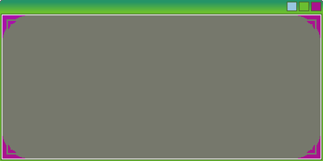

# Alpha-Green
伺かで使えるバルーンです。 
  
  
  

## Font
yuru7様のHack Requirements Nerd Font Complete.tty をお借りしています。
[HackGen](https://github.com/yuru7/HackGen/blob/master/LICENSE)

## Requirements
伺か/SSP 2.6.85で動作を確認しています。 

## Installation
適当なゴーストにD&Dすることでインストールされます。  

## 更新履歴
2025-04-22
選択済みのリンクのカラーを黒から薄い黄色に変更

## Author
ambergon
